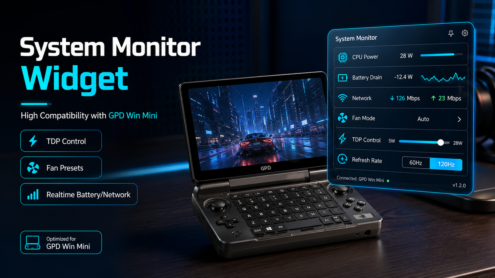

# System Monitor Widget cho GPD Win Mini

System Monitor Widget là widget Windows nhẹ để theo dõi hệ thống và chỉnh nhanh hiệu năng cho máy handheld GPD. App đã được thử nghiệm trực tiếp trên **GPD Win Mini Ryzen 7 7840U** và được thiết kế cho nhu cầu dùng màn hình nhỏ: xem CPU power, nhiệt độ, pin, mạng, TDP, gyro và fan profile ngay khi chơi game.



## Tải về

Bản khuyên dùng cho người dùng phổ thông:

[Download SystemMonitor-hotfix39.zip](https://github.com/handsomecat101/handheld-system-monitor/raw/next/releases/SystemMonitor-hotfix39.zip)

Nên tải bản ZIP vì trong đó đã có đủ:

- `SystemMonitor.exe`
- `Run-SystemMonitor-Admin.cmd`
- thư mục `amd/` chứa runtime cần thiết
- file hướng dẫn `README_RUN.txt`

Không khuyến nghị tải riêng file EXE nếu bạn không biết cách đặt kèm các file phụ. Nếu vẫn cần EXE riêng:

[Download SystemMonitor.exe](https://github.com/handsomecat101/handheld-system-monitor/raw/next/dist-hotfix39/SystemMonitor.exe)

## Cách chạy từng bước

1. Tải `SystemMonitor-hotfix39.zip`.
2. Chuột phải vào file ZIP, chọn `Extract All...` hoặc `Giải nén tất cả`.
3. Mở thư mục vừa giải nén.
4. Double click `Run-SystemMonitor-Admin.cmd`.
5. Khi Windows hỏi quyền Administrator, bấm `Yes`.
6. App sẽ mở lên và có thể điều khiển TDP.

Quan trọng: **phải chạy quyền Administrator nếu muốn chỉnh TDP**. Nếu chỉ double click `SystemMonitor.exe` không có quyền Admin, giao diện monitor có thể vẫn mở nhưng chỉnh TDP có thể không hoạt động.

## Tính năng chính

- Theo dõi CPU package power, nhiệt độ CPU, pin, battery ETA, mạng, tốc độ download/upload.
- Chỉnh TDP nhanh bằng preset và slider custom 4W-25W thông qua `ryzenadj`.
- Fan profile: `Off`, `Low`, `Medium`, `Max`, `Auto`.
- Hiển thị gyro `Available/Unavailable` và nút `Off/On` đơn giản.
- Có chế độ full/compact, ghim cửa sổ, cài đặt hiển thị block, chuyển ngôn ngữ ENG/VIE.
- Có kiểm tra cập nhật trong app: tự báo popup khi có bản mới và có nút kiểm tra thủ công trong Cài đặt hiển thị.
- Chạy độc lập, không cần Motion Assistant.

## Tương thích

Đã thử nghiệm:

- GPD Win Mini dùng AMD Ryzen 7 7840U.

Có thể tương thích:

- Các máy GPD khác dùng AMD Ryzen 7840U hoặc 8840U có khả năng hoạt động vì cùng nền tảng AMD handheld.
- TDP và cảm biến hệ thống có khả năng tương thích cao hơn fan control.
- Fan control phụ thuộc EC của từng máy nên cần test riêng trên từng model.

## Lưu ý quan trọng về fan

Fan control vẫn đang là tính năng thử nghiệm trên GPD Win Mini 7840U. App có thể ghi PWM vào EC, nhưng trên máy test đã có trường hợp UI báo đã apply mà RPM vẫn là `0 rpm`.

Nếu fan không quay hoặc máy nóng bất thường:

1. Chuyển fan về `Auto`.
2. Đóng app.
3. Reboot máy nếu cần.
4. Không chơi game nặng khi nhiệt độ cao mà fan không quay.

## Gửi feedback

Khi báo lỗi, vui lòng gửi:

- Model máy GPD đang dùng.
- CPU là 7840U hay 8840U.
- Đang cắm sạc hay dùng pin.
- TDP đang set bao nhiêu W.
- Fan đang ở mode nào và RPM hiển thị bao nhiêu.
- Ảnh chụp app nếu UI bị lỗi.

## Chạy từ source cho người phát triển

```powershell
powershell -NoProfile -ExecutionPolicy Bypass -Sta -File .\TdpDrainWidget.ps1
```

## Build EXE

```powershell
powershell -NoProfile -ExecutionPolicy Bypass -File .\scripts\Build-SystemMonitorExe.ps1 -OutputPath .\dist-hotfix39\SystemMonitor.exe -Version 1.0.39.0
```

## Cấu trúc chính

```text
.
|-- amd/                         # runtime AMD/EC
|-- assets/                      # icon/image
|-- docs/                        # hướng dẫn và ảnh
|-- dist-hotfix39/               # bản EXE mới nhất hiện tại
|-- releases/SystemMonitor-hotfix39.zip
|-- scripts/Build-SystemMonitorExe.ps1
|-- Launch-TdpDrainWidget.cmd
|-- README.md
`-- TdpDrainWidget.ps1           # source chính
```
