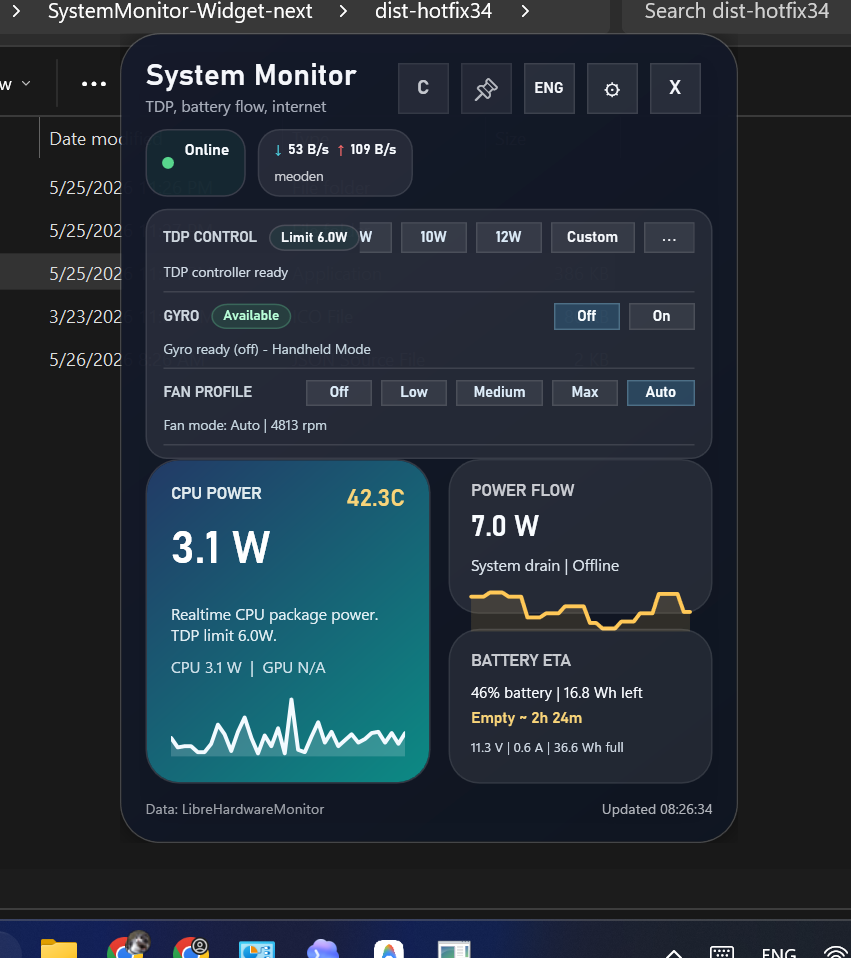

# Hướng dẫn sử dụng - System Monitor Widget cho GPD Win Mini



## Giới thiệu nhanh

System Monitor Widget là công cụ monitor và điều khiển nhanh cho Windows handheld, tập trung vào **GPD Win Mini Ryzen 7 7840U**. App giúp xem nhanh điện năng CPU, nhiệt độ, pin, mạng, TDP và một số chế độ handheld ngay trong một cửa sổ nhỏ.

## Điểm mạnh hiện tại

- Giao diện gọn, dễ nhìn trên màn hình handheld.
- Có chế độ full/compact để dùng khi chơi game.
- Có chuyển ngôn ngữ `ENG/VIE`.
- Có điều khiển TDP nhanh qua `ryzenadj`.
- Có hiển thị battery ETA, power flow, CPU power, network speed.
- Có gyro block đơn giản: phát hiện `Available/Unavailable`, bật/tắt bằng một nút.
- Có fan profile `Off`, `Low`, `Medium`, `Max`, `Auto` để tiếp tục test thay thế Motion Assistant.

## Cách chạy nhanh

Cách khuyên dùng cho người test:

1. Mở thư mục project.
2. Double click `Launch-TdpDrainWidget.cmd`.
3. Launcher sẽ tự mở bản mới nhất, hiện tại là `dist-hotfix38\SystemMonitor.exe`.

Chạy từ source:

```powershell
powershell -NoProfile -ExecutionPolicy Bypass -Sta -File .\TdpDrainWidget.ps1
```

## Cấu hình gợi ý

Chơi nhẹ hoặc ưu tiên pin:

- TDP: 6W-8W
- Fan: Auto hoặc Low
- Refresh: 60Hz nếu cần tiết kiệm pin

Dùng cân bằng:

- TDP: 10W-12W
- Fan: Auto hoặc Medium
- Theo dõi nhiệt độ trong card CPU Power

Chơi nặng khi cắm sạc:

- TDP: 15W trở lên tùy game
- Fan: Auto hoặc Max nếu fan control hoạt động ổn trên máy của bạn
- Dừng test nếu nhiệt độ tăng nhanh mà quạt không quay

## Lưu ý quan trọng về quạt

Fan control hiện vẫn là phần cần kiểm chứng thêm trên GPD Win Mini 7840U. App có thể ghi PWM vào EC, nhưng trên máy test đã có trường hợp UI báo đã apply mà RPM vẫn là `0 rpm`.

Nếu quạt không chạy:

1. Chuyển về `Auto`.
2. Đóng app.
3. Reboot nếu máy vẫn giữ trạng thái lạ.
4. Không chơi game nặng khi nhiệt độ cao mà quạt không quay.

## Những thứ đã bỏ khỏi hướng hiện tại

- Profile manager: tạm bỏ vì làm UI rối.
- Charge limit 80/90/95: không giữ vì chưa có cách ngắt sạc thật ổn định trên GPD Win Mini 7840U; cảnh báo phần mềm không đủ giá trị.
- Sidebar mode: tạm bỏ vì từng gây lỗi không gọi cửa sổ app lên được.

## Gửi feedback

Khi gửi lỗi, nên kèm:

- Ảnh chụp app.
- Bản đang chạy, ví dụ `dist-hotfix38`.
- Máy đang cắm sạc hay dùng pin.
- TDP đang set bao nhiêu W.
- Fan đang ở mode nào và RPM hiển thị bao nhiêu.
- Game/app đang chạy nếu lỗi xảy ra khi chơi game.

## Mục tiêu dự án

Mục tiêu là tạo một widget nhẹ, dễ dùng, tương thích cao với GPD Win Mini, đủ tốt để chia sẻ cho bạn bè test và cập nhật dần qua từng bản hotfix.
